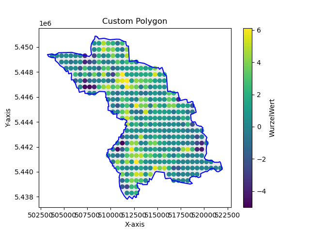

# WurzelWertErmittlung



## Project Overview

WurzelWertErmittlung is a project designed to analyze and visualize geographic data using Python.
This includes generating point clouds, analyzing data within specific radii, and plotting results on a map.


### Setup and Installation

#### 1. **Create a Virtual Environment**

To ensure project dependencies are isolated, create a virtual environment:

```sh
python3 -m venv WurzelWert
```

#### 2. **Activate the Virtual Environment**

Activate the virtual environment:

  ```sh
  source WurzelWert/bin/activate
  ```

#### 3. **Install Dependencies**

With the virtual environment activated, install the necessary Python libraries:

```sh
pip install matplotlib shapely numpy
```

#### 4. **Run the Program**

Execute the main script to run the program:

```sh
python -m src.main
```

#### 5. **Deactivate the Virtual Environment**

When you’re finished, deactivate the virtual environment:

```sh
deactivate
```
